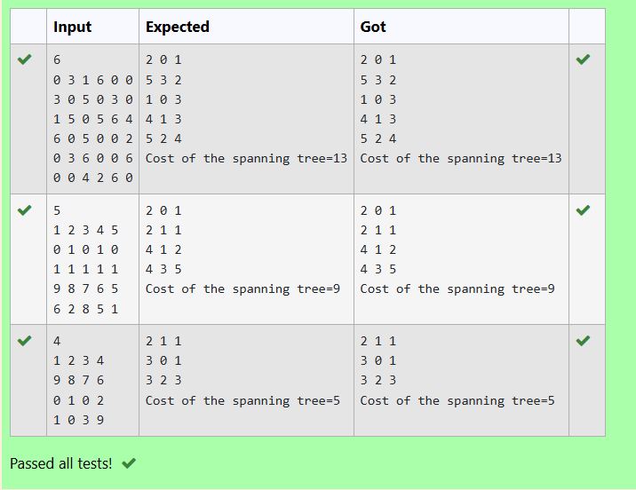

# Ex27 Kruskal’s Algorithm
## DATE:
## AIM:
To write a C program to implement Kruskal's Algorithm for finding minimum cost

## Algorithm
1. Create a list of all edges and sort them by increasing weight.  
2. Initialize each vertex to be in its own separate set.  
3. For each edge in the sorted list:  
4. If the edge connects vertices from different sets, add it to the spanning tree.  
5. Merge the two sets to which the connected vertices belong. 

## Program:
```
/*
Program to implement Kruskal's Algorithm
Developed by: D Vergin Jenifer
RegisterNumber: 212223240174
#include<stdio.h>
 
#define MAX 30
 
typedef struct edge
{
int u,v,w;
}edge;
 
typedef struct edgelist
{
edge data[MAX];
int n;
}edgelist;
 
edgelist elist;
 
int G[MAX][MAX],n;
edgelist spanlist;
 
void kruskal();
int find(int belongs[],int vertexno);
void union1(int belongs[],int c1,int c2);
void sort();
void print();
 
int main()
{
int i,j;
scanf("%d",&n);
for(i=0;i<n;i++)
for(j=0;j<n;j++)
scanf("%d",&G[i][j]);
kruskal();
print();
return 0;
}
void kruskal()
{
int belongs[MAX],i,j,cno1,cno2;
elist.n=0;
 
for(i=1;i<n;i++)
for(j=0;j<i;j++)
{
if(G[i][j]!=0)
{
elist.data[elist.n].u=i;
elist.data[elist.n].v=j;
elist.data[elist.n].w=G[i][j];
elist.n++;
}
}
 
sort();
for(i=0;i<n;i++)
belongs[i]=i;
spanlist.n=0;
for(i=0;i<elist.n;i++)
{
cno1=find(belongs,elist.data[i].u);
cno2=find(belongs,elist.data[i].v);
if(cno1!=cno2)
{
spanlist.data[spanlist.n]=elist.data[i];
spanlist.n=spanlist.n+1;
union1(belongs,cno1,cno2);
}
}
}
 
int find(int belongs[],int vertexno)
{
return(belongs[vertexno]);
}
 
void union1(int belongs[],int c1,int c2)
{
int i;

// Text your code here
for(i=0;i<n;i++)
if(belongs[i]==c2)
belongs[i]=c1;


}
 
void sort()
{
int i,j;
edge temp;

// Text your code here
for(i=1;i<elist.n;i++)
for(j=0;j<elist.n-1;j++)
if(elist.data[j].w>elist.data[j+1].w)
{
temp=elist.data[j];
elist.data[j]=elist.data[j+1];
elist.data[j+1]=temp;


}
}
 
void print()
{
int i,cost=0;
for(i=0;i<spanlist.n;i++)
{
printf("%d %d %d\n",spanlist.data[i].u,spanlist.data[i].v,spanlist.data[i].w);
cost=cost+spanlist.data[i].w;
}
printf("Cost of the spanning tree=%d\n",cost);
}

*/
```

## Output:



## Result:
Thus, the C program to implement Kruskal's Algorithm for finding minimum cost is implemented successfully.
