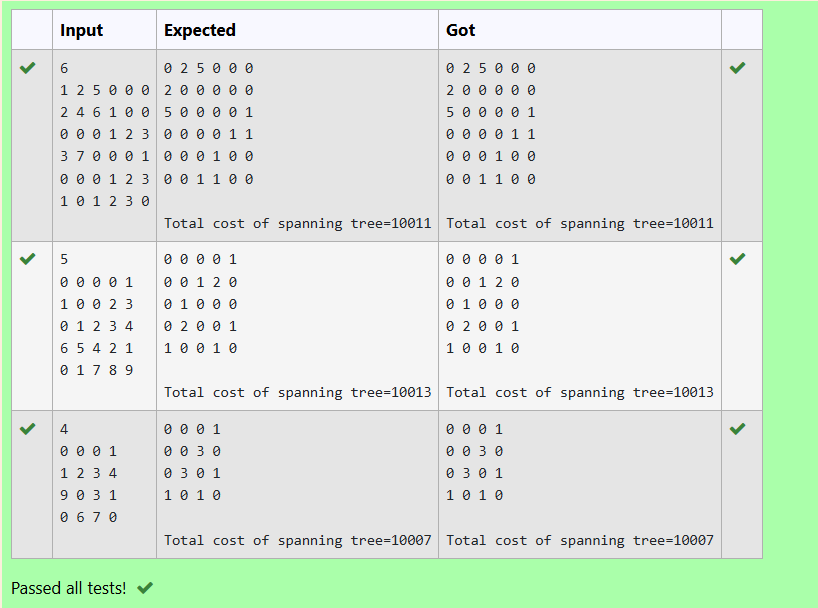

# Ex30 Finding Total Cost of Spanning Tree
## DATE:
## AIM:
To write a C Program to implement Prim's Algorithm for finding Total Cost of spanning tree.
## Algorithm
1. Initialize visited[], distance[], and from[]; set the starting node as visited.  
2. Repeat until the spanning tree has (n - 1) edges:  
3. Select the unvisited node with the smallest distance to the visited set.  
4. Add the corresponding edge to the spanning tree and mark the node as visited.  
5. Update distance[] and from[] for all unvisited nodes based on the newly added node.
## Program:
```
/*
Program to implement Prim's Algorithm for finding Total Cost of spanning tree.
Developed by: D Vergin jenifer
RegisterNumber: 212223240174
#include<stdio.h>
#include<stdlib.h>
 
#define infinity 9999
#define MAX 20
 
int G[MAX][MAX],spanning[MAX][MAX],n;
 
int prims();
 
int main()
{
int i,j,total_cost;
scanf("%d",&n);
for(i=0;i<n;i++)
for(j=0;j<n;j++)
scanf("%d",&G[i][j]);
total_cost=prims();

for(i=0;i<n;i++)
{
for(j=0;j<n;j++)
printf("%d ",spanning[i][j]);
printf("\n");
}
printf("\nTotal cost of spanning tree=%d",total_cost);
return 0;
}
 
int prims()
{
int cost[MAX][MAX];
int u,v,min_distance,distance[MAX],from[MAX];
int visited[MAX],no_of_edges,i,min_cost,j;
//create cost[][] matrix,spanning[][]
for(i=0;i<n;i++)
for(j=0;j<n;j++)
{
if(G[i][j]==0)
cost[i][j]=infinity;
else
cost[i][j]=G[i][j];
spanning[i][j]=0;
}
//initialise visited[],distance[] and from[]
distance[0]=0;
visited[0]=1;
for(i=1;i<n;i++)
{
distance[i]=cost[0][i];
from[i]=0;
visited[i]=0;
}
min_cost=0; //cost of spanning tree
no_of_edges=n-1; //no. of edges to be added
while(no_of_edges>0)
{
//find the vertex at minimum distance from the tree
min_distance=infinity;
for(i=1;i<n;i++)
if(visited[i]==0&&distance[i]<min_distance)
{
v=i;
min_distance=distance[i];
}
u=from[v];
//insert the edge in spanning tree

// Text your code here
spanning[u][v]=distance[v];
spanning[v][u]=distance[v];
no_of_edges--;
visited[v]=1;

//updated the distance[] array

// Text your code here
for(i=1;i<=n;i++)
if(visited[i]==0 && cost[i][v]<distance[i])
{
    distance[i]=cost[i][v];
    from[i]=v;
}
min_cost=min_cost+cost[u][v];
}
return(min_cost);
} 
*/
```

## Output:



## Result:
Thus the C program to implement Prim's Algorithm for finding Total Cost of spanning tree is implemented successfully.
